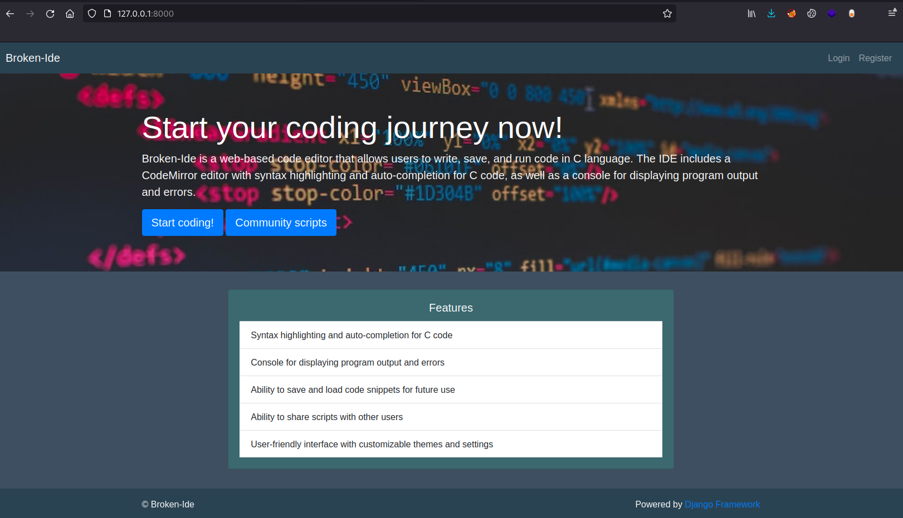
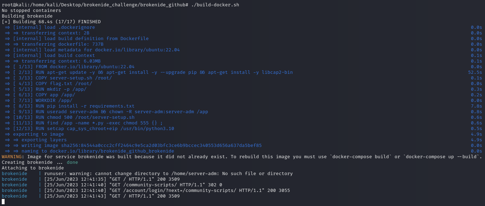

# Broken-Ide

Broken-Ide is an intentionally vulnerable web application based on the Django framework that simulates an online C compiler/ide.

The application is meant for those who want to practice and improve their penetration testing skills.

## Features

The application allows users to register and upload code snippets. The scripts are compiled and then run in a sandbox, so any system commands will not directly affect the host.



Your goal is to hack your way onto the machine (if possible, without beforehand checking the source) and retrieve the flag that is stored in a folder with a random name. The setup is automatically done for you when running the server in a docker container (see Installation).

## Installation

The web application can be run in a docker container by running `build-docker.sh`. This will forward port 8000 on localhost.

```bash
git clone https://github.com/MateiBuzdea/Broken-Ide.git
cd Broken-Ide
chmod +x ./build-docker.sh && ./build-docker.sh
```



The application was tested on Docker version `24.0.2`.

### Alternative setup

The web server can be also run by running the following:

```
cd Broken-Ide/app/brokenide
python3 ./manage.py runserver 8000
```

This will start the Django webserver directly on localhost. Note that Django package has to be installed and the flag will no more be hidden.
If you opt for this configuration, make sure that Python has the `CAP_SYS_CHROOT` capability set:

```
setcap cap_sys_chroot+eip /usr/bin/python3.10
```

### Sandbox configuration

The web server uses chroot in order to sandbox the user scripts. All the code snippets that are run are placed under `app/brokenide/sandbox`. That folder simulates a filesystem and has minimal requirements to run code in it. That setup should be enough for you to exploit the server, but if you want to extend the functionality, you should check out this blog post: https://crossbowerbt.github.io/the_joy_of_chroot.html.

## Notes

If you want to enable the admin dashboard (disabled by default), navigate to `app/brokenide/brokenide/urls.py` and uncomment the admin path. However, this is not intended and you should try to exploit the vulnerability without accessing the admin account.

There are some limitations of the ide:
* Code cannot be run without being saved first
* Some libc functions, such as `system()`, may not work
* I/O functions like `scanf()` will make the server hang because user input is not yet implemented.
